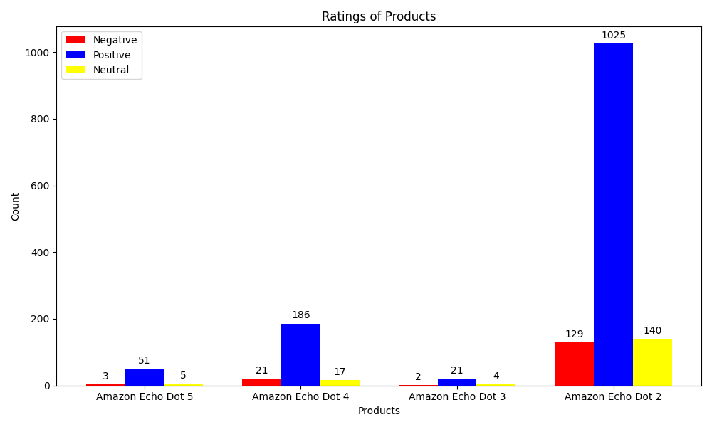

## Package Downloads
- BeautifulSoup (used to scrap html from websites being scraped)
- requests (used to send http requests to the website that is being scraped)
- ollama (used to send queries to phi3)
- matplotlib (used to graph results)
## File Downloads
- Download requirements.yaml file
- Download URLS.txt, main.py, and modules.py
## Running the Code
1. Have conda installed 
2. Run command conda env create -f requirements.yaml to create a conda environment with the requirements 
3. Run main.py inside the environment in vs code
4. An output file Analyzed Amazon_Echo_Dot_#_Reviews.txt will be created for each input url in URLS.txt
5. An output file Amazon_Echo_Dot_#_Reviews.txt will also be created for each input url in URLS.txt 
6. The output files Analyzed_Amazon_Echo_Dot_#_Reviews.txt will contain positive/negative/neutral for each comment based on the comments sentiment
7. A single matplotlib bar graph will be created showing the totals of the sentiments(positive, negative, neutral) for each product url
## What the Program Does
This program takes Ebay URLS as input and returns two output files one for the reviews that are scraped from the urls and one for the analysis of those reviews for example whether those reviews are positive, negative, or neutral 
## Graph of Product Sentiments
